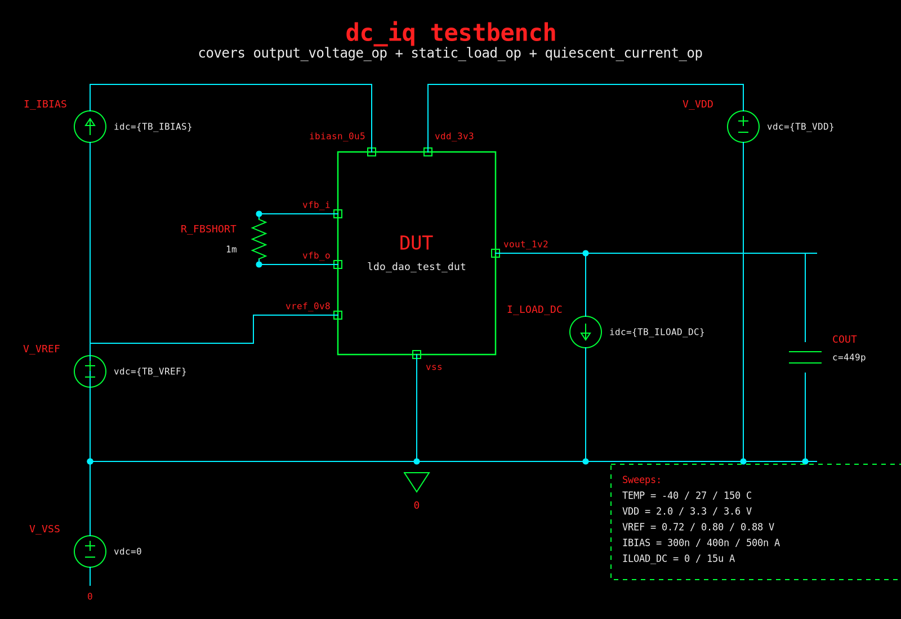
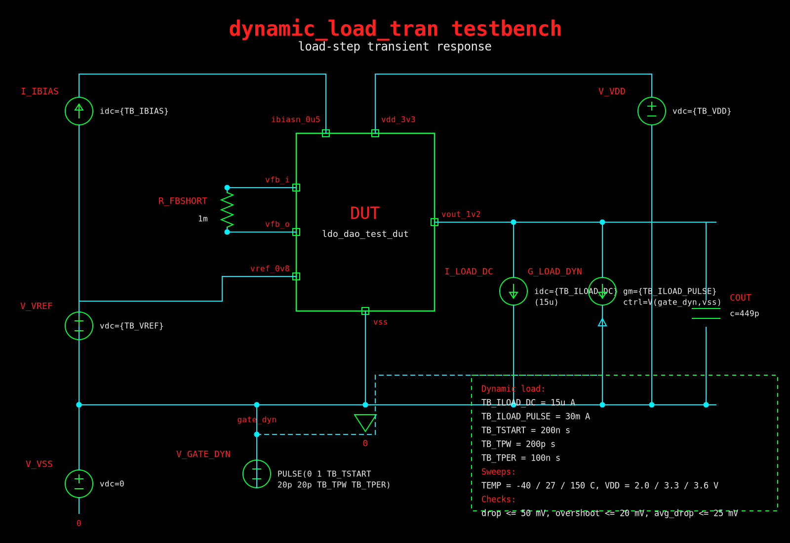
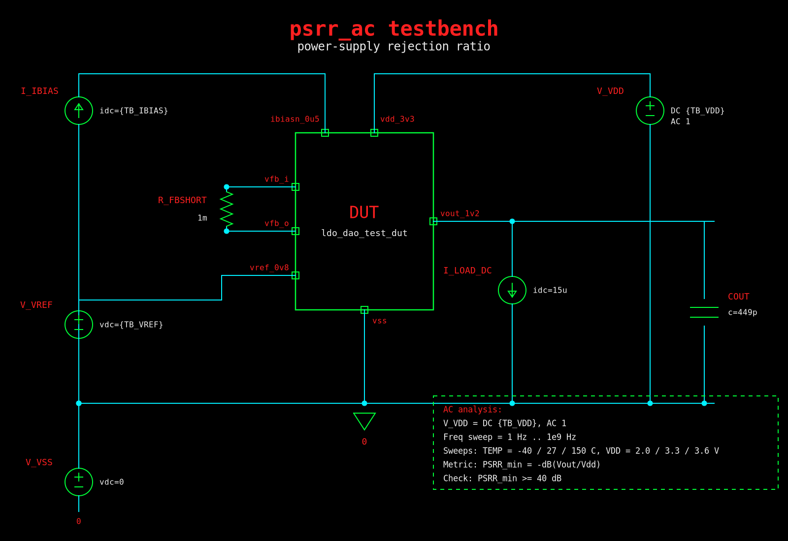
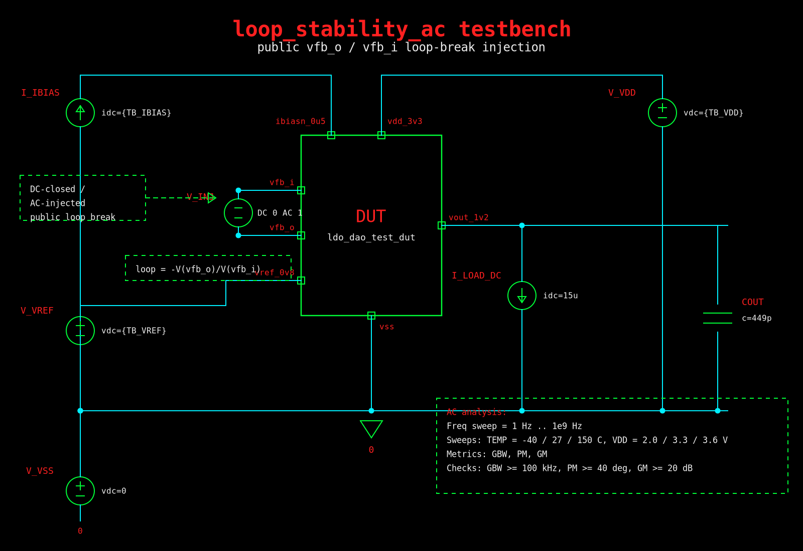
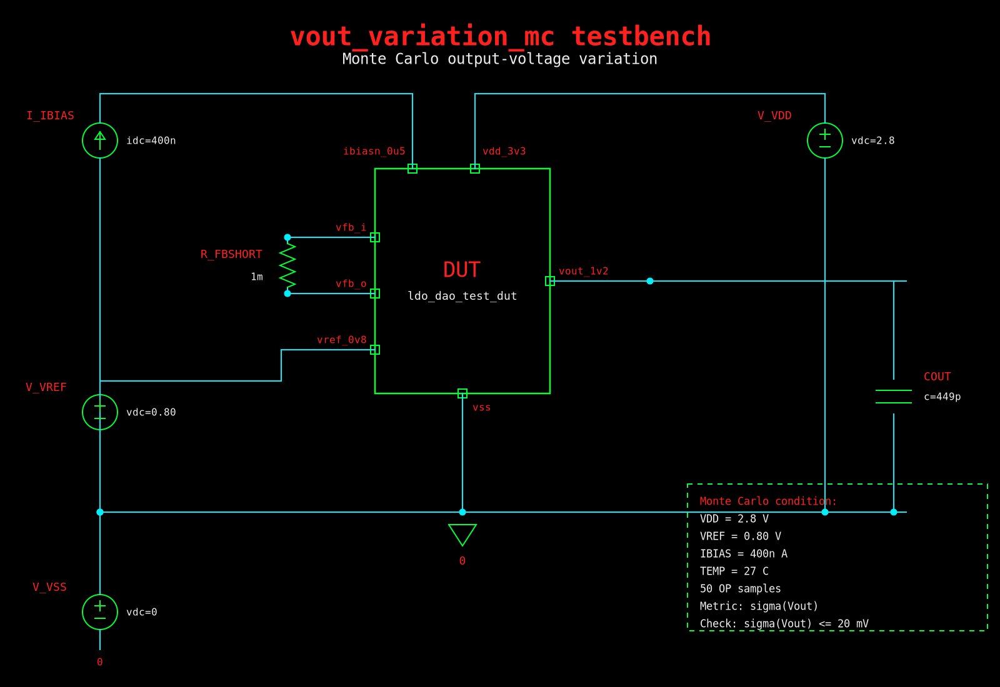

# LDO_DAO acceptance test suite

Пакет содержит стандартные acceptance-тесты для black-box проверки `LDO_DAO` через публичные pins. Требования, условия покрытия и трактовки спорных мест лежат в [verification_plan.md](verification_plan.md).

## 1. Структура проекта

```text
.
├── README.md
├── verification_plan.md        # источник требований и acceptance matrix
├── run_all.sh                  # запуск пакета тестов
├── env.example                 # пример настройки окружения
├── tests/                      # общие SPICE testbench fixtures
├── measures/                   # measurement/control для ngspice и Spectre
│   ├── ngspice/
│   └── spectre/
├── schematics/                 # PNG-схемы тестбенчей
├── examples/                   # mock DUT для smoke-check
└── results/                    # создаётся при запуске
```

`tests/*.sp` являются общими fixture-нетлистами для ngspice и Spectre. `run_all.sh` генерирует top deck, подключает DUT, модели, corner-section и нужный measurement/control файл из `measures/`. DUT подключается через один публичный контракт:

```spice
XDUT vdd_3v3 vout_1v2 vref_0v8 ibiasn_0u5 vfb_i vfb_o vss ldo_dao_test_dut
```

Во всех acceptance fixture используется `COUT = 449 pF` между `vout_1v2` и `vss`.

## 2. Настройка

Скопируйте пример окружения и поправьте пути под свой setup:

```sh
cd ldo_dao_acceptance_suite
cp env.example env.local
vi env.local
source env.local
```

Минимально нужно указать DUT, имя subckt, модели и corners:

```sh
export LDO_DAO_DUT_NETLIST=/abs/path/to/ldo_dao.spi
export LDO_DAO_DUT_SUBCKT=ldo_dao
export LDO_DAO_DUT_STYLE=spice

export LDO_DAO_MODEL_LIB=/abs/path/to/models.scs
export LDO_DAO_MODEL_STYLE=spectre

export LDO_DAO_CORNERS="typical fff ssf fsf sff"
```

Для ngspice DUT и модели должны быть в SPICE-compatible формате:

```sh
export LDO_DAO_DUT_STYLE=spice
export LDO_DAO_MODEL_STYLE=spice
```

Если имена PDK sections отличаются от logical corner names из test plan, задай mapping:

```sh
export LDO_DAO_CORNER_MAP="typical:tt fff:ff ssf:ss fsf:fs sff:sf"
```

## 3. Запуск

После `source env.local` запуск выглядит так:

```sh
./run_all.sh --sim spectre
```

или так:

```sh
./run_all.sh --sim ngspice
```

По умолчанию запускаются основные acceptance-тесты:

```text
dc_iq dynamic_load_tran psrr_ac loop_stability_ac
```

Monte Carlo добавляется явно:

```sh
./run_all.sh --sim spectre --tests all
```

Можно запустить отдельные тесты или ограничить corners:

```sh
./run_all.sh --sim spectre --tests "dc_iq psrr_ac" --corners "typical ssf"
```

Список доступных тестов:

```sh
./run_all.sh --list-tests
```

Smoke-check на mock DUT, если рядом есть ngspice:

```sh
./run_all.sh --sim ngspice --corners typical
```

### 3.1 Воспроизведение текущего SKY130/ngspice прогона

Текущие файлы результатов `sky130_converted_results.csv` и `test_report.md/.pdf`
были получены для механически перенесённого SKY130-примера:

```text
examples/ldo_dao_sky130_from_gf55.sp
```

Воспроизвести этот прогон можно из корня suite такой командой:

```sh
cd ldo_dao_acceptance_suite

LDO_DAO_DUT_NETLIST="$PWD/examples/ldo_dao_sky130_from_gf55.sp" \
LDO_DAO_DUT_SUBCKT=ldo_dao \
LDO_DAO_DUT_STYLE=spice \
LDO_DAO_MODEL_LIB="/home/vadim/work/eda-harness/pdks/sky130A/volare/sky130/versions/0fe599b2afb6708d281543108caf8310912f54af/sky130A/libs.tech/ngspice/sky130.lib.spice" \
LDO_DAO_MODEL_STYLE=spice \
LDO_DAO_CORNER_MAP="typical:tt" \
./run_all.sh --sim ngspice --tests all --corners typical \
  --outdir "$PWD/results/acceptance_strict_sky130_repro"
```

Для `vout_variation_mc` runner автоматически использует mismatch-section
SKY130 (`tt -> tt_mm`) и фиксированный ngspice random seed, чтобы результат был
воспроизводимым. Остальные тесты в этом примере выполняются на nominal `tt`.

Ожидаемый suite status для этого DUT: `FAIL`. Это нормальный результат для
текущего перенесённого примера, а не ошибка запуска тестбенчей.

`dynamic_load_tran` в ngspice использует Gear integration и transient-specific
tolerances в generated deck. Без этих опций SKY130/ngspice срывался на
`Timestep too small` около `v_vref#branch`; текущий runner досчитывает waveform
до окон измерений и репортит реальные `drop_mV`, `overshoot_mV`, `avg_drop_mV`.

`run_all.sh` сам пишет CSV с измеренными метриками, pass/fail и причинами
failures в:

```text
sky130_converted_results.csv
```

Отчёт по этому CSV:

```text
test_report.md
test_report.pdf
```

Полный five-corner прогон (`typical fff ssf fsf sff`) сохранен отдельно:

```text
sky130_full_corner_results.csv
test_report_full_corners.md
test_report_full_corners.pdf
results/acceptance_full_sky130_corners/
```

### 3.2 Статус Spectre

В проекте есть Spectre/SpectreMDL runner и `.mdl` measurement-файлы, но текущий
подтверждённый прогон выполнялся только через `ngspice`.

В текущем окружении `spectre` и `spectremdl` не найдены в `PATH`, поэтому Spectre
запуск не был выполнен и не считается верифицированным. Кроме того, последние
усиления acceptance-проверок сначала внесены и проверены для ngspice flow:

- `dynamic_load_tran` в ngspice использует Gear transient options и сам
  проверяет, дошел ли transient до measurement windows; если нет, он репортит
  `TRAN_NOT_COMPLETED` и `tran_stop_s` без запуска `.meas` на неполном waveform;
- `vout_variation_mc` в ngspice подключает SKY130 mismatch section (`tt_mm`
  для nominal `tt`) и fail-ит отсутствие реальной статистической вариации;
- Spectre MC flow сейчас требует отдельной доработки, чтобы автоматически считать
  и проверять `sigma(Vout)`, а не только сохранять scalar output для ручного review.

Поэтому для воспроизведения результатов из CSV/PDF используйте ngspice-команду
из раздела 3.1. Spectre можно использовать только после отдельной синхронизации
`.mdl` checks и повторного прогона на машине с установленным Cadence SpectreMDL.

## 4. Результаты

Каждый запуск создаёт директорию:

```text
results/<timestamp>_<simulator>/
results/latest -> results/<timestamp>_<simulator>/
```

Главный файл для быстрого просмотра:

```text
results/latest/summary.txt
```

Внутри per-test директорий лежат generated top decks, logs и measurement files:

```text
results/latest/<corner>/<test>/...
```

Ключевые строки в логах:

```text
RESULT ... metric=value ... pass=1
FAIL   ... reason=... value=... limit=...
SUMMARY ... fail_count=N
```

`run_all.sh` возвращает non-zero exit code, если симулятор упал или хотя бы один тест напечатал `FAIL`.

## 5. Общие acceptance conditions

Базовые условия берутся из [verification_plan.md](verification_plan.md):

```text
process corners : typical, fff, ssf, fsf, sff
temperatures    : -40 C, 27 C, 150 C
VDD             : 2.0 V, 3.3 V, 3.6 V
VREF            : 0.72 V, 0.80 V, 0.88 V
IBIAS           : 300 nA, 400 nA, 500 nA
static load     : 15 µA
dynamic load    : 30 mA pulse, 200 ps width, 10 MHz period
MC condition    : typical, 27 C, VDD=2.8 V, VREF=0.80 V, IBIAS=400 nA, 50 samples
```

## 6. Тесты

### 6.1 `dc_iq`



Fixture: [tests/dc_iq.sp](tests/dc_iq.sp)

Этот тест объединяет три старых acceptance-теста: `output_voltage_op`, `static_load_op` и `quiescent_current_op`. Схема работает в нормальном closed-loop режиме: `vfb_o` закорочен на `vfb_i`, `vref_0v8` задаётся внешним источником, `ibiasn_0u5` задаётся токовым источником, а `vdd_3v3` подаётся через измеряемый supply source. На `vout_1v2` всегда подключён `COUT = 449 pF`; DC load переключается между `0` и `15 µA`, чтобы покрыть no-load и static-load условия.

Тест проверяет DC regulation на PVT, а также одномерные sweeps по `VREF` и `IBIAS` относительно nominal corner. Для no-load conditions дополнительно измеряется quiescent current через источник `V_VDD`.

Acceptance checks:

```text
1.08 V <= Vout <= 1.32 V
Iq <= 3 µA
```

### 6.2 `dynamic_load_tran`



Fixture: [tests/dynamic_load_tran.sp](tests/dynamic_load_tran.sp)

Тест проверяет transient response при резкой динамической нагрузке. DUT остаётся в closed-loop режиме через `R_FBSHORT`; на выходе стоят `COUT = 449 pF`, постоянная нагрузка `15 µA` и управляемая импульсная нагрузка. Управляющий источник `V_GATE_DYN` формирует pulse, который включает `G_LOAD_DYN` на `vout_1v2`. Нагрузка соответствует acceptance condition: pulse amplitude `30 mA`, width `200 ps`, period `100 ns`, то есть `10 MHz`.

Тест запускается по PVT. Из transient waveform измеряются pre-step level, минимум, максимум и среднее значение выхода после включения периодической нагрузки.

Acceptance checks:

```text
Vout_drop_abs      <= 50 mV
Vout_overshoot_abs <= 20 mV
Vout_avg_drop      <= 25 mV
```

### 6.3 `psrr_ac`



Fixture: [tests/psrr_ac.sp](tests/psrr_ac.sp)

Тест проверяет power-supply rejection. Схема такая же, как нормальный closed-loop operating point: `vfb_o` закорочен на `vfb_i`, на выходе `COUT = 449 pF` и DC load `15 µA`. Отличие в том, что источник питания `V_VDD` имеет малосигнальную AC amplitude `1`, поэтому AC response на `vout_1v2` напрямую даёт отношение `Vout/Vdd`.

Тест запускается по PVT. Frequency sweep идёт от `1 Hz` до `1 GHz`; по нему считается `PSRR = -dB(Vout/Vdd)`, после чего берётся минимум по sweep.

Acceptance check:

```text
PSRR_min >= 40 dB
```

### 6.4 `loop_stability_ac`



Fixture: [tests/loop_stability_ac.sp](tests/loop_stability_ac.sp)

Тест проверяет loop stability через публичный feedback interface, без доступа к внутренним узлам DUT. В обычных тестах `vfb_o` и `vfb_i` закорочены, а здесь между ними стоит `V_INJ` с `DC 0` и `AC 1`. На DC схема остаётся замкнутой, а в AC через этот элемент вводится perturbation для расчёта loop response. На выходе подключены `COUT = 449 pF` и DC load `15 µA`.

Тест запускается по PVT. Из AC loop response рассчитываются gain-bandwidth, phase margin и gain margin. В ngspice `vp(...)` возвращает фазу в радианах; measurement control явно переводит ее в градусы перед расчетом `PM = 180 + phase_deg`.

Acceptance checks:

```text
GBW >= 100 kHz
PM  >= 40 deg
GM  >= 20 dB
```

### 6.5 `vout_variation_mc`



Fixture: [tests/vout_variation_mc.sp](tests/vout_variation_mc.sp)

Тест проверяет output-voltage statistical variation для isolated LDO. Схема близка к `dc_iq` no-load fixture: closed-loop через `R_FBSHORT`, `COUT = 449 pF`, `VDD = 2.8 V`, `VREF = 0.80 V`, `IBIAS = 400 nA`, `TEMP = 27 C`. В ngspice flow runner автоматически заменяет nominal SKY130 section `tt` на mismatch section `tt_mm`, а control задает фиксированный random seed через `setseed 1`.

Запускается `50` OP samples. По выборке `Vout` считается стандартное отклонение.

Acceptance check:

```text
sigma(Vout) <= 20 mV
```
