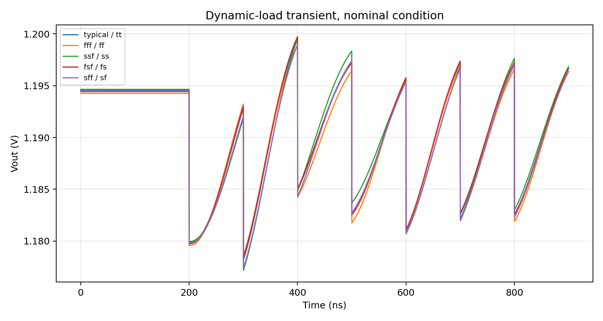
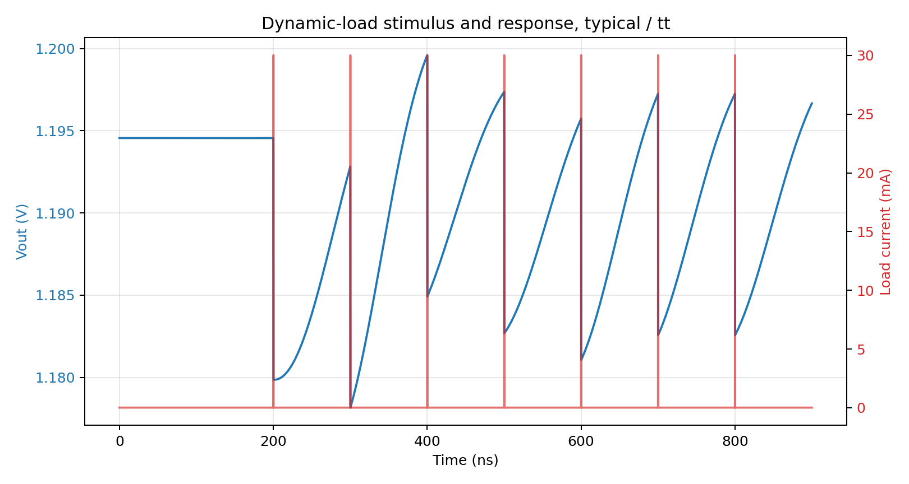
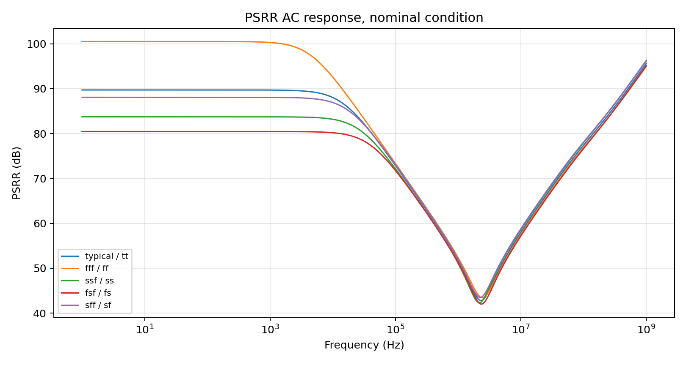
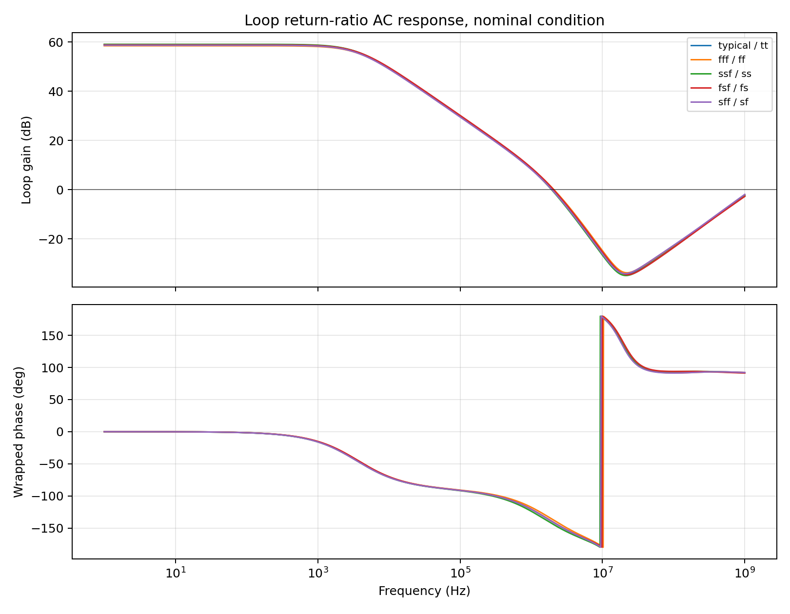

# LDO_DAO SKY130 Acceptance Test Report

## Executive Summary

The full five-corner SKY130/ngspice acceptance suite was rerun from the updated testbenches.
The suite status is **FAIL**. The failing checks are `dc_iq` and `loop_stability_ac`.
`dc_iq` still violates the `Iq <= 3 uA` limit and the low-reference DC output check still fails in several points.
`loop_stability_ac` now reports the corrected ngspice phase margin and fails several PVT points near the `40 deg` limit.

The earlier apparent large change of `Iq_uA` under static load was a test/reporting error: the old report used total VDD source current as `Iq_uA`, so the `15 uA` load current was included. The updated report separates total input current from corrected quiescent current.
The earlier `PM ~= 177 deg` loop-stability result was also a measurement error: ngspice `vp(...)` returned radians, but the old scalar calculation treated that value as degrees.

| Test | Status | CSV metric rows | Failed rows |
|---|---:|---:|---:|
| `dc_iq` | FAIL | 390 | 75 |
| `dynamic_load_tran` | PASS | 315 | 0 |
| `psrr_ac` | PASS | 45 | 0 |
| `loop_stability_ac` | FAIL | 180 | 14 |
| `vout_variation_mc` | PASS | 260 | 0 |

Total CSV rows: 1190. Failed metric rows: 89.

## DUT and Conditions

- DUT netlist: `examples/ldo_dao_sky130_from_gf55.sp`.
- Model library: SKY130 `sky130.lib.spice`.
- Corners: `typical -> tt`, `fff -> ff`, `ssf -> ss`, `fsf -> fs`, `sff -> sf`.
- Output capacitor in all acceptance fixtures: `COUT = 449 pF`.
- Nominal operating point: `VDD = 3.3 V`, `VREF = 0.80 V`, `IBIAS = 400 nA`, `TEMP = 27 C`.
- Static load condition: `15 uA`.
- Dynamic load condition: `15 uA` DC plus `30 mA`, `200 ps`, `10 MHz` pulse load.

## Results by Test

### DC and Quiescent Current

Status: **FAIL**. Failure reasons: `IQ_HIGH`: 65, `VOUT_LOW`: 10.


The DC fixture measures the operating point at `vout_1v2` and the current through the VDD source.
ngspice defines current through a voltage source from the positive terminal into the source, so positive DUT consumption is reported as:

```text
Iin_total_uA = -1e6 * i(V_VDD)
Iq_uA = Iin_total_uA - 1e6 * ILOAD_DC
```

For no-load quiescent-current acceptance, `ILOAD_DC = 0`, so `Iq_uA = Iin_total_uA`.
The acceptance checks are:

```text
1.08 V <= Vout_V <= 1.32 V
Iq_uA <= 3.0 uA
```

Measured ranges:

| Metric | Range |
|---|---:|
| `Vout_V` | 1.07433 .. 1.31663 |
| `Iin_total_uA` | 9.96236 .. 27.1023 |
| `Iq_uA` | 9.93972 .. 12.1207 |

No-load `Iq_uA` range: 9.962 .. 12.12 uA.
Loaded corrected `Iq_uA` range: 9.94 .. 12.1 uA.
Loaded total input-current range: 24.94 .. 27.1 uA.

Interpretation: the previous `~10 .. 27 uA` quiescent-current range mixed no-load current with total input current under a `15 uA` external load. After correction, `Iq_uA` remains around `10 .. 12 uA`; this is still above the `3 uA` limit, but it no longer shows the artificial `15 uA` load-current jump.

The DUT netlist contains an internal feedback-divider path of approximately `40.0176 kOhm + 40.0176 kOhm + 40.0176 kOhm`, which alone implies about `1.2 V / 120 kOhm ~= 10 uA`. That matches the corrected no-load `Iq_uA` and explains why the current limit still fails.

### Dynamic-Load Transient

Status: **PASS**. Failure reasons: none.


The transient fixture measures a pre-step level, a minimum, a maximum, and a dynamic average:

```text
Vout_pre       = avg(V(vout_1v2), 150 ns .. 190 ns)
Vout_min       = min(V(vout_1v2), 200 ns .. 400 ns)
Vout_max       = max(V(vout_1v2), 200 ns .. 400 ns)
Vout_dyn_avg   = avg(V(vout_1v2), 400 ns .. 900 ns)

drop_mV      = max(0, 1000 * (Vout_pre - Vout_min))
overshoot_mV = max(0, 1000 * (Vout_max - Vout_pre))
avg_drop_mV  = max(0, 1000 * (Vout_pre - Vout_dyn_avg))
```

Acceptance limits are `drop_mV <= 50`, `overshoot_mV <= 20`, and `avg_drop_mV <= 25`.

Measured ranges:

| Metric | Range |
|---|---:|
| `drop_mV` | 14.699 .. 21.567 |
| `overshoot_mV` | 0 .. 5.977 |
| `avg_drop_mV` | 4.211 .. 8.471 |
| `Vout_min_V` | 1.1702 .. 1.18073 |





### PSRR AC

Status: **PASS**. Failure reasons: none.


The PSRR fixture applies `AC 1` on `V_VDD`, so the AC output transfer directly gives `Vout/Vdd`:

```text
ratio(f)     = V(vout_1v2, f) / V(vdd_3v3, f)
PSRR_dB(f)   = -20 * log10(|ratio(f)|)
PSRR_min_dB  = min(PSRR_dB(f)), f = 1 Hz .. 1 GHz
```

The acceptance limit is `PSRR_min_dB >= 40`.

Measured range:

| Metric | Range |
|---|---:|
| `PSRR_min_dB` | 41.6887 .. 43.8687 |



### Loop Stability AC

Status: **FAIL**. Failure reasons: `PM_LOW`: 14.


The loop-stability fixture keeps the DC feedback path closed with a zero-volt injection source between the public feedback pins and injects `AC 1`.
The ngspice return-ratio expression is:

```text
T(f) = -V(vfb_o, f) / V(vfb_i, f)
loop_gain_dB(f) = 20 * log10(|T(f)|)
loop_phase_deg(f) = rad_to_deg(wrapped_phase(T(f)))

GBW_Hz = first f where loop_gain_dB(f) crosses 0 dB falling
PM_deg = 180 + loop_phase_deg(GBW_Hz)
```

The acceptance limits are `GBW_Hz >= 100 kHz`, `PM_deg >= 40 deg`, and `GM_dB >= 20 dB`.

Measured ranges:

| Metric | Range |
|---|---:|
| `GBW_Hz` | 1.4845e+06 .. 2.33599e+06 |
| `PM_deg` | 35.7024 .. 48.9131 |
| `GM_dB` | 23.9618 .. 26.9461 |



Interpretation: ngspice `vp(...)` returns phase in radians in this flow. The measurement control converts it to degrees before calculating phase margin. The loop-stability result should therefore be read from the corrected `PM_deg` range above, not from the legacy report that added a radian phase directly to `180`. The failing points are phase-margin failures, while gain bandwidth and gain margin remain above their limits.

### Monte Carlo Output Variation

Status: **PASS**. Failure reasons: none.


The Monte Carlo fixture runs 50 operating-point samples using the SKY130 mismatch sections and reports:

```text
mean_V    = average(Vout_i)
sigma_mV  = 1000 * standard_deviation(Vout_i)
```

The acceptance limit is `sigma_mV <= 20`.

Measured ranges:

| Metric | Range |
|---|---:|
| `mean_V` | 1.19568 .. 1.19587 |
| `sigma_mV` | 17.3908 .. 17.8922 |

## Conclusions

The test bug behind the apparent load-dependent quiescent-current swing is fixed: total input current and corrected quiescent current are now reported separately.

The DUT still fails DC acceptance because corrected no-load `Iq_uA` is roughly `10 .. 12 uA`, above the `3 uA` requirement, and low-reference points still violate the output lower bound.

The loop-stability scalar must use degree-converted ngspice phase. A stronger follow-up would still be to compare this public-pin return-ratio setup against a Middlebrook/Tian-style return-ratio setup or against simulator-native stability analysis.
